# Create Order
{docsify-updated}

Overview of the Create Order Process

## Header tab

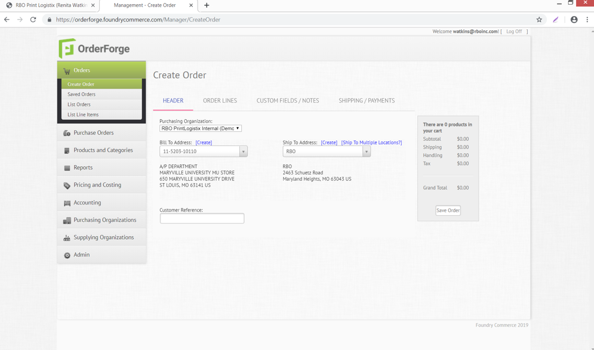

Choose purchasing organization (Customer) - choose bill to and ship to (create if necessary – your new address will only be available from manual order entry view – must add to OrderForge store front if needed there) – Customer reference is designated at an order level (use for Customer PO#)

You can save your order (Saved order button) at any time when processing and return later to complete or resume with next tab.

## Order Lines tab
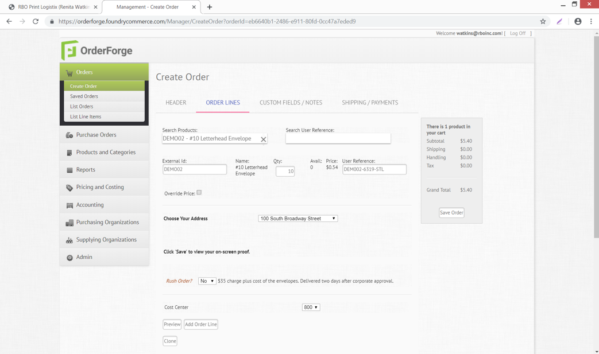

**Search products** – search for existing products setup – you can **clone** (button at bottom of screen) that product and save using your customer’s product naming convention……example: DEMO02 pull product and clone then save under product # TEST022 - #10 LH Envelope. Then you can make any changes you want to the product you created.

**Search User Reference** – is used to search for the last time this product was ordered to do a repeat, but a user reference must have been added when the product was last ordered.

**External id** – product you are ordering

**Quantity Avail** – inventory level available

**Unit of issue**

**Price** – sell to customer

**User Reference** – used to pull product up again later to repeat (last time ordered will pull)

**Override price** – you can check this and override pricing that shows prefilled in the pricing area

**Template Section** – This

**Cost Center** – this is a special added feature for this customer

**Preview** – proof review for this the line item entered

When finished click **add order line** button

Your order line will appear at the bottom of the screen - Click the + sign to open up your view of the product – additional tabs will appear under the product, which are product specific information needed to process that product line.

Click the **edit** to enable the ability to make changes to the product line. When finished with changes click **update.**

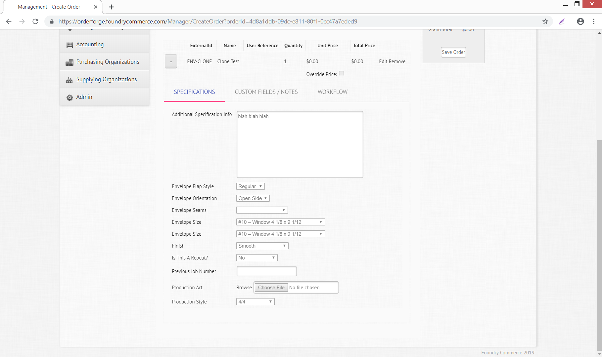

**Specifications** – detail of information pertaining to the product specifically – below you will see information about an item such as stock, size, type of envelope. This information is added to the specification tab when a product is created in OrderForge

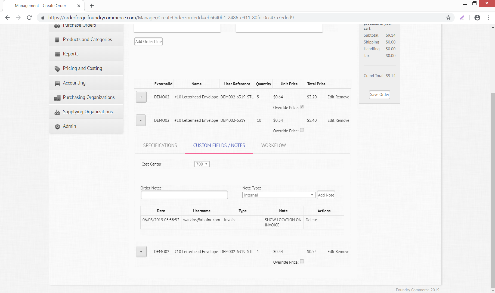

**Custom Fields/Notes** – customized information collected for that specific product line – this example shows a cost center and also some internal invoice notes for accounting

As you add notes you will need to choose from the Note Type drop down box, enter your notes in the Order Notes box and then click Add Notes button. If you choose Supplier those notes will appear on the PO sent to the supplier

You also have the option to delete the notes if you need to or add additional ones.

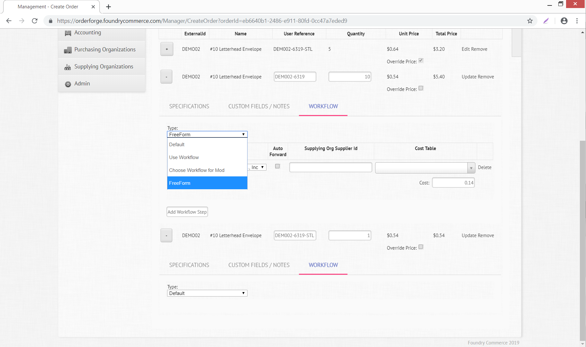

**Workflow** – ability to create the Order and have it generate a PO automatically to the supplier by assigning a workflow. Workflow is created per product added to the Order.

Default - option to use a workflow that was created when the product was originally setup

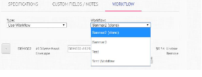

Use Workflow - option to use existing workflows already created in OrderForge

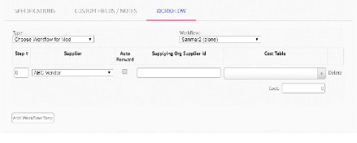

Choose Workflow for Mod – option allows you to use an existing workflow but modify it to fit your needs for that product being ordered

Supplier (vendor) choices on workflow – Supplying Org Supplier ID may need to be filled in for specific suppliers (ie..BCSI) – Cost Table can be added to this product or you can enter the cost manually in the Cost field

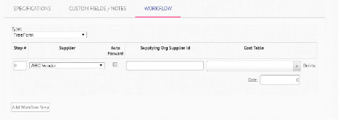

FreeForm – option allows you to create each step of your workflow as new per product (Example: this product stock is ordered from the paper house and then sent to DOC for printing). It would look like the screen below when finished.

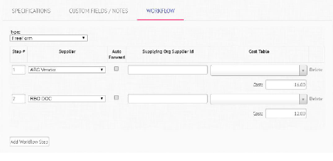

This shows a PO will generate to ABC Vendor 1st and RBO DOC 2nd. Costs can be added manually or a cost table can be assigned to that product. The autofoward option is also available and works for both suppliers only if clicked on. You cannot have it autoforward to just one supplier and not the other.

When completing details in all three tabs – Specifications, Custom Fields/Notes, Workflow – you need to make sure and select Update for that product line to complete the additions or changes for that product.

## Custom Fields/Notes
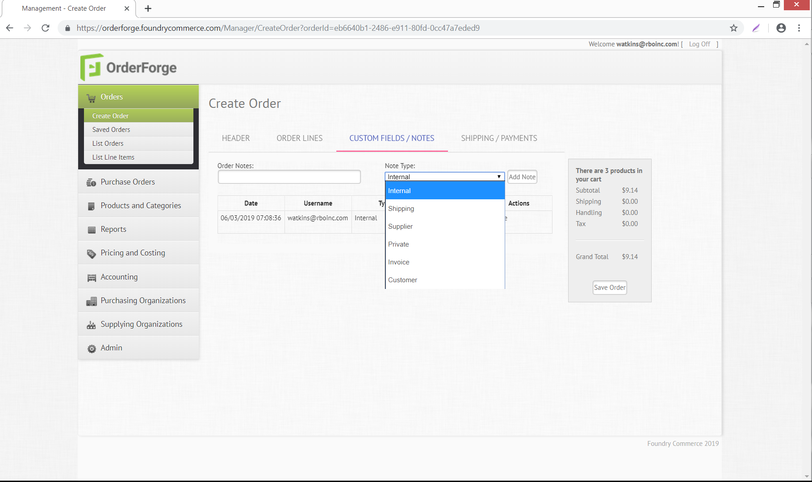

this tab is used to document order information at an order level – you can choose multiple note types (just like you do at a product level) to indicate instructions within an order – the order notes is where you type your comments – when finished click the button called Add Note

## Shipping/Payments
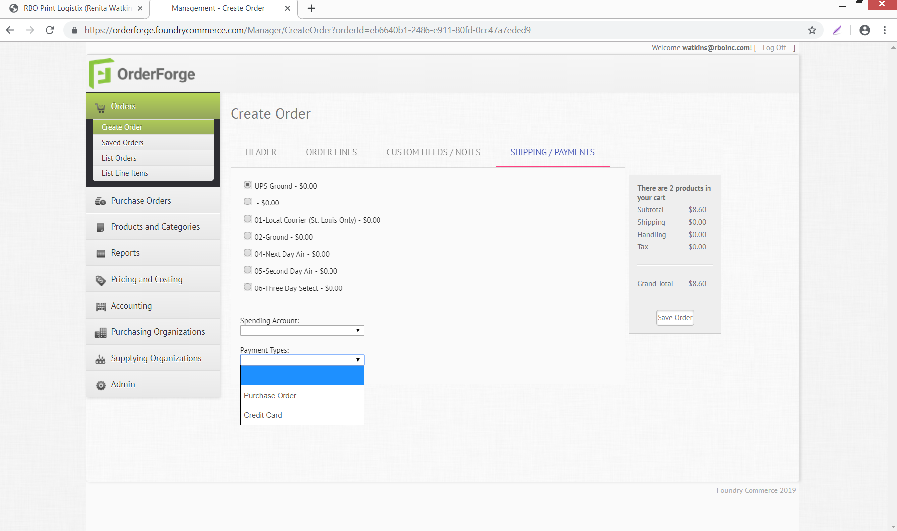

This tab allows you to choose your shipping method (these methods showing above have been set up specifically for this customer’s account) - each purchasing organization will need shipping methods added at the time they are setup in OrderForge – Spending account is a special option available if the purchasing organization has requested this functionality

Payment Types – see below

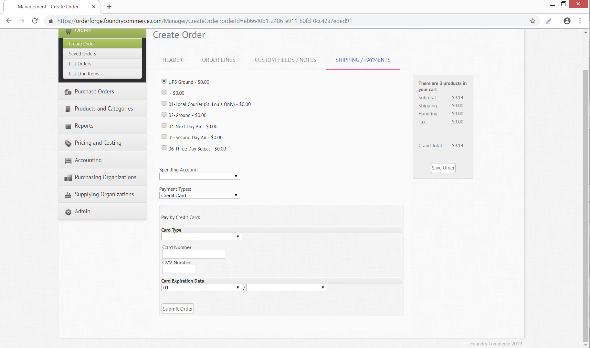

Payment Types – choosing Purchase Order payment type will allow you to process the order as a normal purchase. Credit Card payment type will require you to enter the customer’s credit card information at the time you place the order.

After this screen information has been captured hit Submit Order button to process the order OR you can Save Order and process at a later time.
